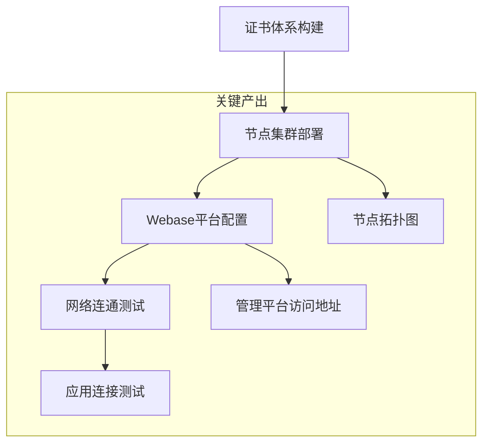

# 区块链捐赠系统联合开发总任务书

## 项目目标
构建基于联盟链的捐赠管理系统，实现用户身份安全认证、交易可追溯、多机构协作的核心能力，完成1.0版本基础功能交付与2.0版本扩展框架搭建

---

## 项目里程碑
| 阶段 | 时间窗口 | 关键交付物 |
|------|----------|------------|
| 基础设施搭建 | 2025-03-25至03-28 | 1. 多机构联盟链网络<br>2. Webase管理平台<br>3. 证书体系文档 |
| 核心功能开发 | 2025-03-29至04-02 | 1. 用户认证模块<br>2. 智能合约系统<br>3. 前后端联调报告 |
| 系统联调测试 | 2025-04-03至04-05 | 1. 全链路测试用例<br>2. 性能压测报告<br>3. 安全审计记录 |
| 扩展功能迭代 | 2025-04-06至04-10 | 1. 用户反馈模块<br>2. 多类型捐赠支持<br>3. 跨链数据验证 |

---

## 跨职能任务矩阵

### 一、区块链基础设施层（运维主导）


### 二、智能合约层（合约工程师主导）
1. **开发规范**
   - 合约版本：Solidity 0.6.10
   - 加密标准：keccak256哈希算法
   - 错误处理：require语句校验参数

2. **部署流程**
```bash
# 典型部署命令示例
./console deploy UserStorage.sol
>> 合约地址：0x123...456
>> 部署交易哈希：0x789...abc
```

### 三、应用系统层（开发工程师主导）
```vue
// 前端路由配置示例
{
  path: '/login',
  component: () => import('@/views/Login.vue'),
  meta: { requiresAuth: false }
},
{
  path: '/manager/studentFeedback',
  component: () => import('@/views/StudentFeedback.vue'),
  meta: { requiresAdmin: true }
}
```

---

## 跨团队协作机制

### 接口对接标准
| 模块 | 接口类型 | 协议规范 | 负责人 |
|------|----------|----------|--------|
| 区块链连接 | RESTful API | OpenAPI 3.0 | 运维工程师 |
| 合约调用 | Web3j SDK | Java 11+ | 合约工程师 |
| 前端交互 | Axios HTTP | JSON-RPC | 开发工程师 |